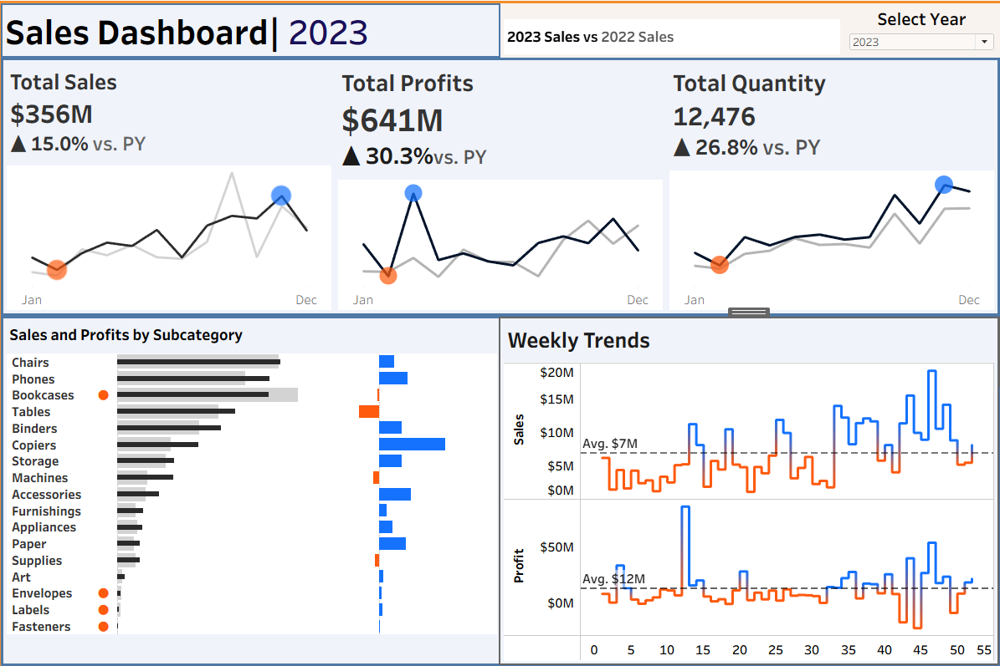
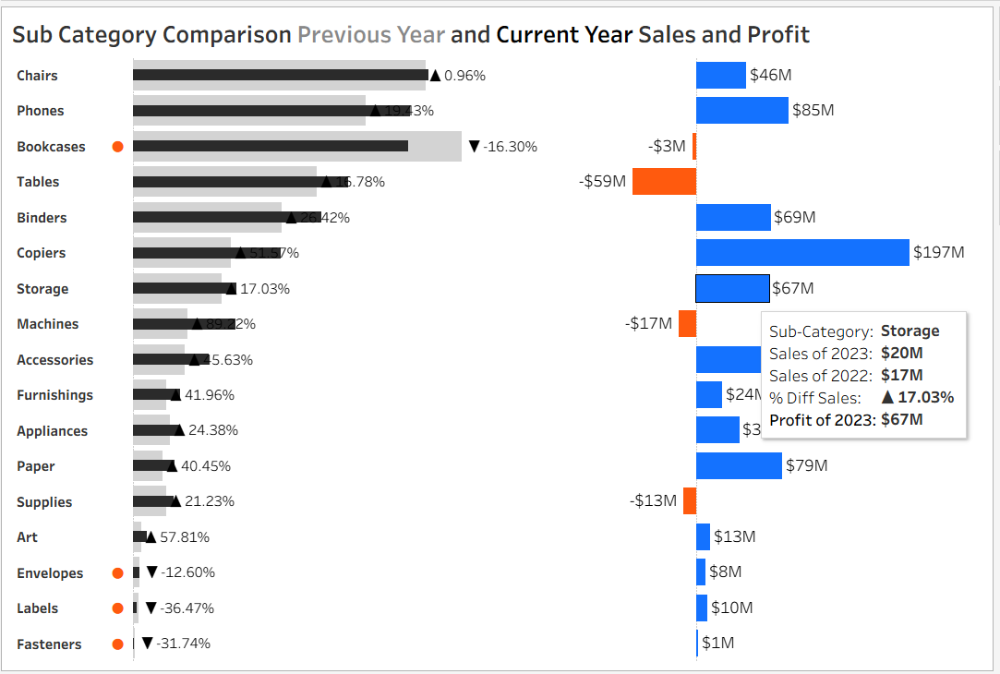
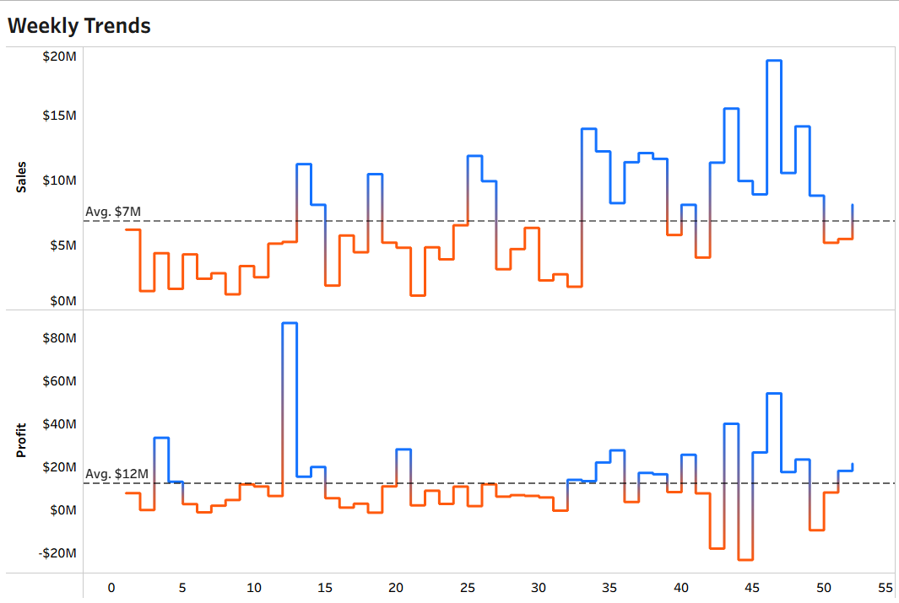

# SalesDashboard-Tableau
## 📊 Interactive Sales Dashboard  | Tableau Project

This project presents a dynamic **Sales Performance Dashboard** built using Tableau. It visualizes annual trends, KPIs, subcategory-level performance, and weekly trends using an interactive and insightful design.

> 📌 Built following the YouTube tutorial by Baraa Bou-Saada  
> 🎥 [Watch the tutorial here](https://www.youtube.com/watch?v=dahrmqT5GD4&t=4366s)

---

## 📷 Dashboard Preview

  
> *Visual snapshot of the interactive dashboard built in Tableau*

---

## 🌐 Live Dashboard

🔗 [Click here to view the interactive dashboard on Tableau Public](https://public.tableau.com/app/profile/dima.naeem/viz/SalesDashboard_17428741637750/Dashboard1?publish=yes)

---
## 🔍 **Project Goal**  
To analyze sales trends across regions/categories and identify growth opportunities.  

## ❓ Business Questions Answered

- What are the total sales, profits, and quantity sold in 2023?
- How do sales and profits compare to the previous year?
- Which product subcategories are most and least profitable?
- What are the weekly trends in sales and profits throughout the year?

---

## 📈 Key KPIs & Insights

| Metric              | Value      | Insight |
|---------------------|------------|---------|
| **Total Sales**     | $356M      | ▲ 15.0% YoY Growth |
| **Total Profits**   | $641M      | ▲ 30.3% YoY Growth |
| **Total Quantity**  | 12,476     | ▲ 26.8% YoY Growth |
| **Top Profitable Subcategory** | Copiers | Highest margin generator |
| **Lowest Performing Subcategories** | Art, Labels, Envelopes | Loss-making areas |
| **Weekly Trends**   | $7M avg sales, $12M avg profit | Strong spikes during Q4 |

---
## 📊 Sales & Profits by Subcategory

> 🔍 **Observation:**  
> - **Copiers** generated the highest profit at **$197M** with moderate sales volume.  
> - **Tables** showed high sales but suffered a massive **loss of $59M**, making it the **least profitable** subcategory.  
> - **Art, Envelopes, Labels, and Fasteners** all performed poorly, contributing negligible or negative profit.  
> - Other loss-making subcategories include **Machines (-$17M)** and **Supplies (-$13M)** despite moderate sales.  
> - This analysis highlights areas to **optimize or reconsider inventory and pricing strategy**.

---

## 📆 Weekly Sales & Profit Trends

> 📊 **Observation:**  
> - Sales and profit were relatively low during the early part of the year 2023 but showed significant **growth in Q3 and Q4**, especially around weeks 40–50.  
> - **Current year trends (blue)** consistently outperform the **previous year (orange)**, especially in later weeks.  
>- **Profitability Paradox**: Top 3 categories (Copiers, Phones, Machines) drove 60% of profit but only 35% of sales.  
>- **YoY Growth**: 2023 sales increased by 12%, though cost controls needed to boost profit growth beyond 5%.
> - Spikes in profits indicate **successful promotions or high-value transactions**, likely around seasonal events or campaigns.

## ⚙️ **Technical Highlights**  
**Advanced Tableau Features**:  
- **LOD Expressions**: Created `{FIXED}` calculations to analyze category profitability independent of filters.  
- **Dynamic YoY Logic**: Used `LOOKUP()` table calculations for % growth comparisons.  
- **Parameter Controls**: Enabled real-time toggling between CY/PY data with `IF` statements.  

**Why It Matters**: These techniques ensured accurate, scalable analysis—critical for business decisions.  

## 🔍 Advanced Analysis: Profit Outliers
**Implementation**:  
- Used **window calculations** (`WINDOW_MAX/MIN`) to dynamically highlight extreme values.  
- Paired with conditional formatting to visually flag risks/opportunities.  

**Impact**:  
- Isolated unprofitable products (min profit) needing pricing strategy revisions.  
- Spotlighted top performers (max profit) for regional expansion.  

## 🛠️ Tools & Skills Used

- **Tableau** – Interactive dashboard design, calculated fields(% Diff, YoY KPIs), parameters, interactive filters
- **Data Analysis** – Trend analysis, KPI calculation, subcategory breakdown
- **Data Cleaning** – Done via Excel / Tableau Prep, Joined tables
- **Calculations** - Created LOD expressions for YoY, YTD comparison
- **Business Intelligence (BI)** – Actionable insights for decision-making
- **Business Insights**: Identified high-margin products and seasonal trends.  
---

## 🙋 Author

**Dima Naeem Mirza**  
🧠 Data Analyst | 📊 Tableau Enthusiast | 🔐 Cybersecurity Learner  
📫 [Connect on LinkedIn](https://www.linkedin.com/in/dimanaeem)

---

## 🙏 Acknowledgments

Thanks to **Baraa Bou-Saada | Data with Baraa** for his amazing Tableau tutorial and guidance.

---
